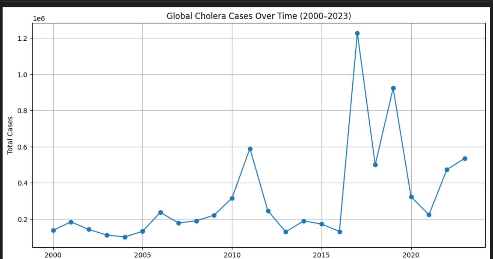
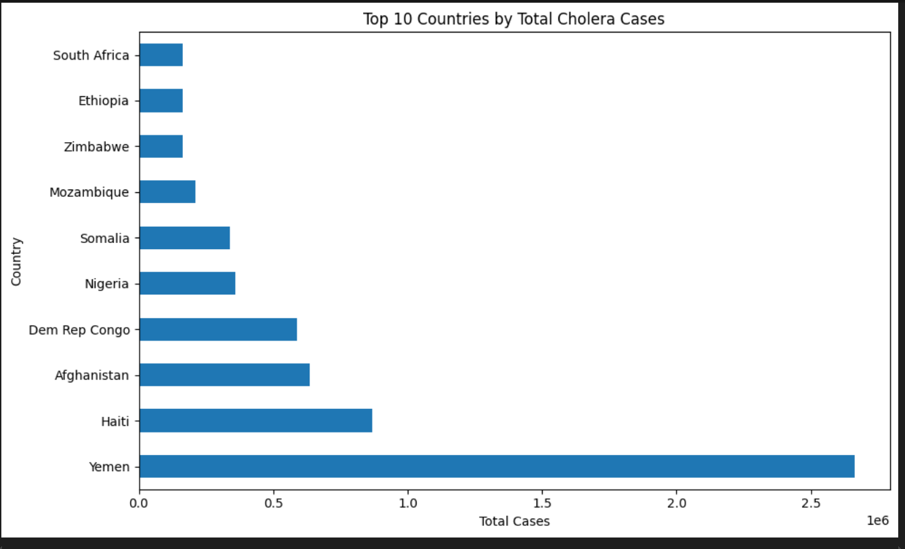
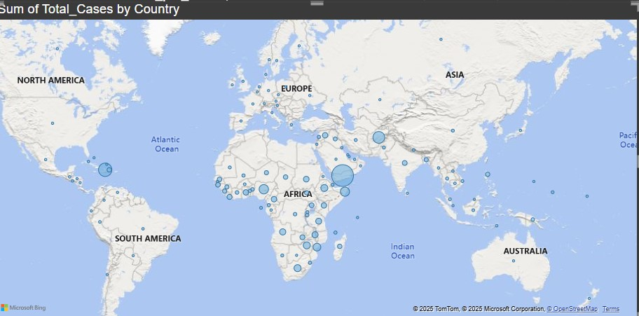
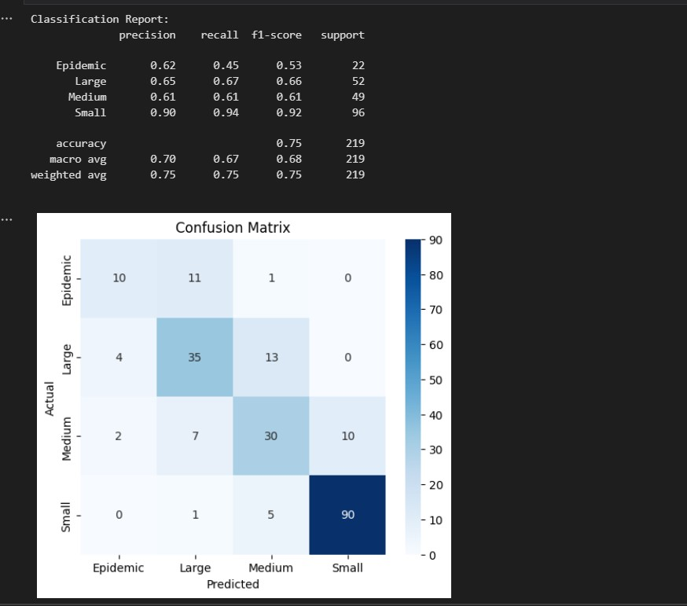
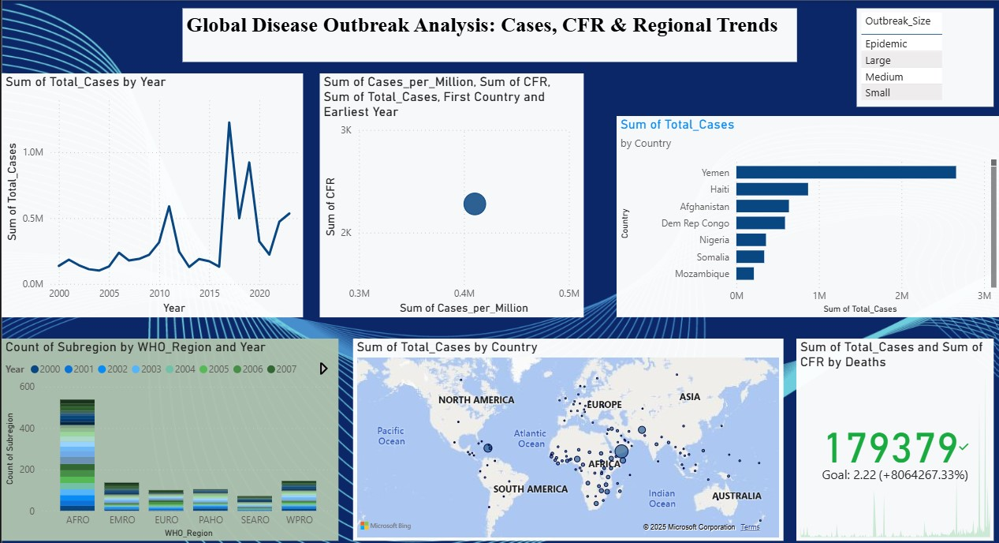

# Cholera-Capstone-Project

Predictive Analytics for Cholera Outbreaks (2000–2023)

This project applies data science and machine learning to predict cholera outbreak severity based on historical surveillance data, enabling proactive public health responses. The analysis supports goals of the WHO and GTFCC to reduce cholera deaths through early intervention, better targeting, and resource optimization.

1. # Project Overview

   Project_Capstone dane By: Huruma Innocent, ID:25514
   Course: Introduction to Big Data Analytics  
   Institution Adventist University of Central Africa (AUCA)  
   Year: 2024–2025  
   Sector: Health  
   Dataset Source: [WHO Cholera Cases and Deaths](https://www.who.int/emergencies/surveillance/cholera-cases-and-deaths)  
   Tools: Python, Scikit-learn, Pandas, GeoPandas, Power BI

2. Problem Statement
   Cholera remains a global public health threat, causing thousands of deaths annually, especially in low- and middle-income countries. Traditional reactive responses delay intervention, increasing mortality and spread.

**Predict annual cholera case trends and outbreak severity using historical, environmental, and regional health data.**

## Methodology

### 🔹 Step 1: Data Collection & Cleaning

- Source: WHO (2000–2023), 1,094 country-year records
- Recalculated Case Fatality Rate (CFR)
- Removed outliers (CFR > 50%)
- Created categorical variable `Outbreak_Size`
- Encoded regions and normalized features
    

### 🔹 Step 2: Exploratory Data Analysis (EDA)

- Global trends of cholera cases and deaths
  
- CFR comparison by WHO region
- Top 10 countries by total cases
  
- Correlation heatmaps of CFR, Incidence Rate, and Total Cases
  

### 🔹 Step 3: Machine Learning

- **Model**: Random Forest Classifier
  
- **Target**: `Outbreak_Size` (Small, Medium, Large, Epidemic)
- **Features**: Year, CFR, Incidence per million, Region (encoded)
- **Evaluation**: Confusion matrix, classification report
  

### 🔹 Step 4: Innovation

- `risk_alert()` function: Flags countries with high CFR and case volume
- Geo-mapping of cholera hotspots using GeoPandas + Contextil

3. Power BI Dashboard

An interactive dashboard was developed in **Power BI** to visualize:

- Global case trends (2000–2023)
  
- Region-wise fatality and outbreak size
  
- Top 10 affected countries
  
- Map visual with slicers for year and region
  
  Dashbord
  

Let it serve as a reminder that excellence, integrity, and commitment matter  
whether in data science, public health, or everyday life.
